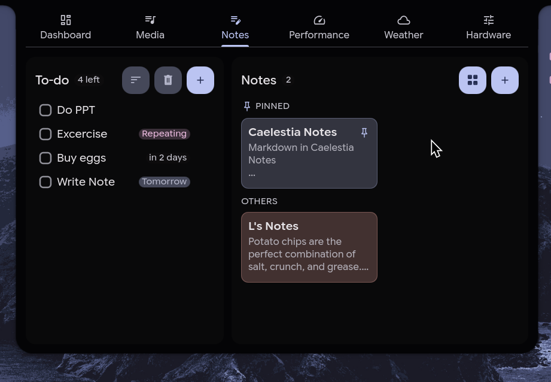
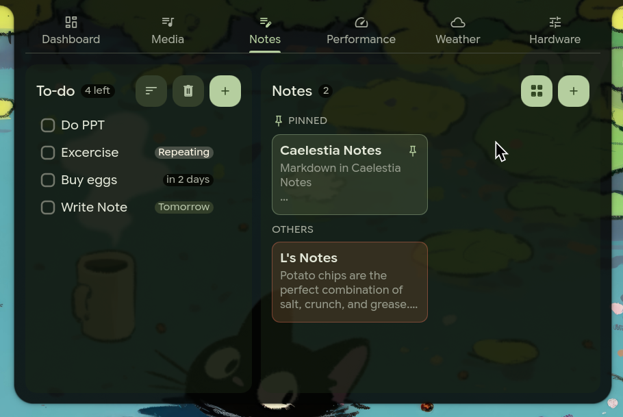
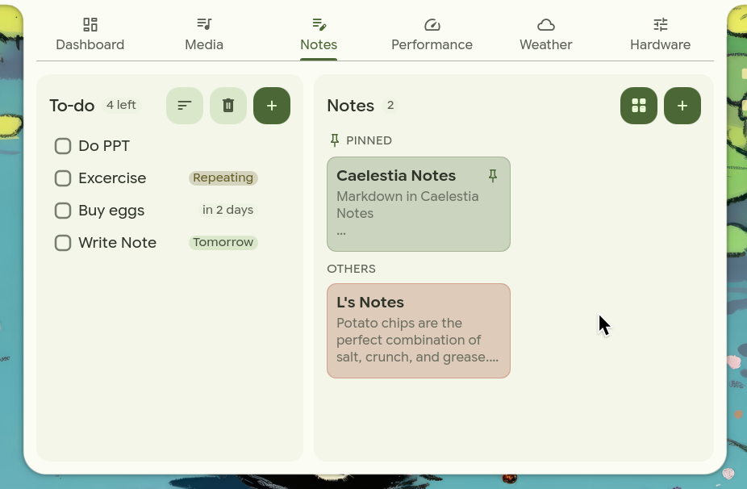

<p align="center"></p>

<h1 align="center">Caelestia Notes</h1>

<p align="center">Notes and to-dos as a tab in your Caelestia Shell dashboard.<br>Markdown, repeating daily habits, Material 3 styling, and your data stays in a local file.</p>

<p align="center">
  <a href="https://denzils-repo.github.io/Caelestia_Notes/">Website</a> ·
  <a href="#install">Install</a> ·
  <a href="guide.md">Markdown guide</a> ·
  <a href="#troubleshooting">Troubleshooting</a>
</p>

<p align="center">
  
  
  
  
  
</p>

<table>
  <tr>
    <td align="center"><br><sub>Dark</sub></td>
    <td align="center"><br><sub>Transparent glass</sub></td>
    <td align="center"><br><sub>Light</sub></td>
  </tr>
</table>

---

## What it is

Caelestia Notes adds a **Notes** tab to the dashboard of the [Caelestia shell](https://github.com/caelestia-dots/shell). The left side is a to-do list, the right side is a board of Markdown notes. Everything is written in QML and follows your Caelestia colours.

It is an **unofficial add-on**, not part of the Caelestia shell, and not affiliated with its maintainers. Caelestia is working on a plugin system. Until it ships, the installer in this repository adds the tab in a way that is small, reversible, and designed to get out of the shell's way (see [Safe by design](#safe-by-design)).

---

## Features

### Notes
- **Markdown notes.** Headings, bullet and numbered lists, block quotes, code blocks, dividers, bold, italic, strikethrough, inline code and links. See the [Markdown guide](guide.md).
- **Editing is separate from rendering.** A note opens as a rendered preview; double-click to edit the raw text.
- **Shaped bullets.** Each bullet in a list gets a Material 3 shape (cookie, sunny, gem and others). The shape is chosen automatically and stays the same every time you open the note.
- **Pin and colour.** Pinned notes sit in their own section at the top. Each note has one of five colours: none, primary, secondary, tertiary or rose. They are taken from your Caelestia theme, so they change with your wallpaper.
- **Grid or list** layout, remembered between sessions.
- **Two-step delete.** Deleting a note asks you to confirm with a second click. Deleted notes are not kept in a trash.

### To-dos
- **Quick add.** Type in the "Add a new to-do…" field and press Enter.
- **Due dates.** Pick any date from the calendar; the picker marks your choice with a slowly rotating four-leaf clover. Tasks show *Today*, *Tomorrow*, *in N days* or *Overdue*.
- **Repeating habits.** Toggle *Repeating* on a task. Once done, it resets at midnight, and the list shows how long until the reset.
- **Sorting.** One button switches between newest first and due-date order (overdue, then soonest).
- **Trash.** Deleted tasks and completed habits go to separate trash pools. You can restore items or empty the trash.

### Look and feel
- Follows your Caelestia theme in dark, transparent and light modes.
- Native QML only: no web view, no network access.

---

## Install

**You need:** Caelestia shell 2.2.0 or newer, Quickshell, Qt 6, the `M3Shapes` QML module (already a Caelestia dependency, `qt6-m3shapes-git` on Arch), `python3`, and either `git` or `curl` + `tar`. Caelestia 2.4.0 and 2.5.0 are tested; see [Compatibility](#compatibility).

### 1. Check first (changes nothing)

```bash
curl -fsSL https://raw.githubusercontent.com/Denzils-repo/Caelestia_Notes/main/install.sh | bash
```

This finds your shell, checks versions and dependencies, downloads the Notes files into its own cache, verifies them, and prints what it *would* do. Nothing in your shell is touched.

### 2. Install

```bash
curl -fsSL https://raw.githubusercontent.com/Denzils-repo/Caelestia_Notes/main/install.sh | bash -s -- --install
```

It shows the exact edits it will make and asks before applying them. Quickshell normally reloads when its files change, so the tab should appear within a moment. If it doesn't, restart the shell (`caelestia shell -d`).

> **Installed Caelestia from the AUR (`caelestia-shell`)?** Add `--user-copy`.
> Caelestia's maintainers say not to edit the files the package installs, so this installer never does, and never uses `sudo`. With `--user-copy` it first makes your own copy of the shell at `~/.config/quickshell/caelestia` (the arrangement Caelestia recommends for tweaks) and installs there. Quickshell prefers that copy over the packaged one.
>
> ```bash
> curl -fsSL https://raw.githubusercontent.com/Denzils-repo/Caelestia_Notes/main/install.sh | bash -s -- --install --user-copy
> ```
>
> Your copy does not follow package updates by itself. See [Updating](#updating).

**Prefer to read the script first?**

```bash
curl -fsSLO https://raw.githubusercontent.com/Denzils-repo/Caelestia_Notes/main/install.sh
less install.sh
bash install.sh --install
```

### Options

| Option | What it does |
| :--- | :--- |
| *(none)* | Check only. Read-only. |
| `--install` | Check, then install the Notes files and register the tab. Safe to re-run. |
| `--uninstall` | Remove the tab registration and the files this installer added. |
| `--user-copy` | Packaged installs only: create your own copy of the shell first. |
| `--yes` | Don't ask questions. |
| `--no-register` | Copy the files but don't edit any Caelestia file. |
| `--no-keyboard` | Skip the keyboard-focus edit. Typing in Notes may not work. |
| `--force` | Overwrite files that belong to the shell itself. For your own fork only. |
| `--repo URL`, `--branch NAME` | Install from a different source. |

### What the installer changes

| Where | What |
| :--- | :--- |
| `modules/dashboard/NotesTab.qml`, `modules/dashboard/notes/*.qml` | New files (the tab and its parts). |
| `services/NotesStore.qml` | New file (state and saving). |
| `modules/dashboard/Content.qml` | **Edited.** One marked block adds the tab entry, one adds a loader. |
| `modules/drawers/ContentWindow.qml` | **Edited.** One marked line lets the dashboard take keyboard focus, which typing needs. |
| `~/.config/caelestia/notes.default.json` | Starter notes, used only when you have no notes file. |
| `~/.local/share/caelestia-notes/` | The installer's own cache, backups and manifest. |

It never touches `~/.local/state/caelestia/notes.json`, your notes.

The keyboard-focus change applies to the whole dashboard, not only Notes: while the dashboard is open, clicking inside it can give it keyboard focus. If you would rather not have that, use `--no-keyboard`.

---

## Safe by design

- **A broken Notes tab can't break your dashboard.** The tab is loaded through a wrapper and a loader that points at a file path. If the Notes files are missing, damaged, or no longer match the shell after an update, only the Notes tab shows *"Notes failed to load. Re-run the Caelestia Notes installer."* and every other tab keeps working. A plain `NotesTab {}` reference would take the whole dashboard down in that situation.
- **The shell wins.** If a file the installer wants to write belongs to the shell (tracked in its git checkout, or owned by a package), it stops instead of overwriting it.
- **Every edit is marked and reversible.** Edits to Caelestia files sit between `// >>> caelestia-notes` and `// <<< caelestia-notes` comments. `--uninstall` removes exactly those blocks and restores the original line in `ContentWindow.qml`.
- **Backups, verification, rollback.** Files are written next to their destination and renamed into place. Anything it replaces is backed up first, results are checked against the source, and a failed install restores your files.
- **It refuses what it doesn't recognise.** If a patch point has moved or a line has been customised, it leaves that file alone and tells you.
- **It never uses `sudo`** and never edits packaged files.
- **The payload is audited.** Before installing, it checks that the QML never runs programs or opens network connections, and syntax-checks every file when a Qt 6 `qmllint` is available. The only external call is opening a link in your browser when you click one in a note.

---

## Updating

**Notes itself:** run the install command again. It fetches the latest version, replaces only files that changed (backing up the old ones) and leaves your notes alone.

**After a Caelestia update**, the Notes tab may disappear because the update restored the original `Content.qml`. The shell keeps working. Run the install command again to bring the tab back.

| How you installed Caelestia | After updating Caelestia |
| :--- | :--- |
| Git checkout in `~/.config/quickshell/caelestia` | Run `--uninstall`, then `git pull`, then `--install`. This keeps `git pull` free of conflicts. |
| AUR package, using `--user-copy` | Your copy stays on the old version while the package moves on. Because the compiled plugin comes from the package, recreate the copy: run `--uninstall`, then `rm -rf ~/.config/quickshell/caelestia`, then `--install --user-copy`. The installer warns you when the two versions differ. |

---

## Using Notes

| Do this | To get this |
| :--- | :--- |
| Type in *Add a new to-do…* and press `Enter` | Adds a task. |
| Click the repeat toggle before adding | Makes it a repeating daily habit. |
| Click the date button | Opens the calendar to set a due date. |
| Click the sort button | Switches between newest first and due-date order. |
| Click the trash button | Opens the trash for tasks and habits. |
| Click `+` in the Notes panel | Creates a note. |
| Click a note | Opens it as a rendered preview. |
| Double-click the preview | Edits the Markdown source. |
| Press `Esc` or the back arrow | Saves and returns to the board. |
| Click the pin icon | Pins or unpins the note. |
| Click the delete icon, then click again | Deletes the note (permanent). |
| Click the grid/list button | Switches the board layout. |

---

## Your data

| File | Purpose |
| :--- | :--- |
| `~/.local/state/caelestia/notes.json` | Your notes, to-dos, trash and view settings. Plain JSON. |
| `~/.local/state/caelestia/notes.json.bak` | The contents from just before the most recent save. A one-step safety net, not a history. |
| `~/.config/caelestia/notes.default.json` | Starter notes. Used only if `notes.json` is missing or can't be read. |

- The notes file is watched, so edits made by another program or a sync tool appear without a restart.
- If `notes.json` is damaged, Notes loads the starter notes instead. Restore your data by copying `notes.json.bak` back before making any new change; the next save replaces the backup.
- Back up `notes.json` however you like (git, Syncthing, a cron job). It is a normal file.

---

## Compatibility

| Caelestia shell | Status |
| :--- | :--- |
| 2.5.0 and current `main` | Install, tab, typing, failure fallback and uninstall tested on a real system (Arch, Qt 6.11, Quickshell 0.3.1). |
| 2.4.0 | Notes runs on it on the author's system. The installer's edits were verified on a copy of that shell but have not yet been loaded in it. |
| 2.2.0 and 2.3.0 | The install patches apply and the shell components Notes depends on exist, but it has not been run. |
| Older than 2.2.0 | Not supported. |
| Nix | Not supported: the shell lives in the read-only Nix store. |

---

## Troubleshooting

**The installer says BLOCKED.** Read the `[FAIL]` lines; each says what to fix. Nothing was changed.

**It says only the packaged shell was found.** You installed Caelestia from the AUR. Re-run with `--user-copy` (see [Install](#install)).

**The tab doesn't appear.** Check that the install finished without `[FAIL]`. If Caelestia was just updated, run the install command again. Then restart the shell: quit Quickshell and start it with `caelestia shell -d`.

**The tab says "Notes failed to load".** The Notes files no longer match your shell (usually after an update). Run the install command again. If it keeps failing, run it with `--uninstall` and open an issue with your shell version.

**Typing in Notes does nothing.** The dashboard needs keyboard focus. The installer adds it unless you used `--no-keyboard`, or your `ContentWindow.qml` has a customised `keyboardFocus` line (the installer leaves those alone and says so). If you edit that line yourself, make the dashboard state (`screenState.dashboard`) one of the conditions that gives focus.

**"Your user copy shadows the system package."** You have your own shell copy and the package too. That is fine; it only reminds you that package updates won't change what runs.

**"Config loaded with N issues" toast.** That comes from your own `~/.config/caelestia/shell.json` and has nothing to do with Notes.

**Other settings.** The installer looks in `~/.config/quickshell/caelestia` and `/etc/xdg/quickshell/caelestia`. If your shell lives elsewhere, set `CN_USER_DIR=/path/to/shell` for the command.

---

## Do it by hand

If you don't want to run the installer, `--no-register` copies the files and you register the tab yourself. In `modules/dashboard/Content.qml`, add an entry to the tab list before the Performance entry:

```qml
{
    component: notesComponent,
    iconName: "edit_note",
    text: qsTr("Notes"),     // use Tr.tr("Notes") if your Content.qml uses Tr.tr
    enabled: true
},
```

and this component next to the other `Component` blocks:

```qml
Component {
    id: notesComponent

    Item {
        implicitWidth: notesLoader.item ? notesLoader.item.implicitWidth : 840
        implicitHeight: notesLoader.item ? notesLoader.item.implicitHeight : 480

        Loader {
            id: notesLoader
            anchors.fill: parent
            source: Qt.resolvedUrl("NotesTab.qml")
        }

        StyledText {
            anchors.centerIn: parent
            visible: notesLoader.status === Loader.Error
            text: qsTr("Notes failed to load. Re-run the Caelestia Notes installer.")
        }
    }
}
```

For typing, make `WlrLayershell.keyboardFocus` in `modules/drawers/ContentWindow.qml` also react to `screenState.dashboard`.

---

## Repository layout

```text
Caelestia_Notes/
├── install.sh                   # installer (check / install / update / uninstall)
├── README.md
├── guide.md                     # Markdown syntax and how the renderer works
├── LICENSE                      # GPL-3.0
├── index.html                   # website (GitHub Pages)
├── logo.png, logo-256.png       # logo (full size, and a small copy for the web)
├── dark.png, light.png, transparent.png   # screenshots
├── config/
│   └── notes.default.json       # starter notes
├── services/
│   └── NotesStore.qml           # state, saving, repeat reset
└── modules/dashboard/
    ├── NotesTab.qml             # the tab: to-dos left, notes right
    └── notes/
        ├── NotesPanel.qml       # notes board
        ├── NoteCardItem.qml     # a note card
        ├── NoteStackCard.qml    # stacked-card visual
        ├── NoteDetailView.qml   # note viewer and editor
        ├── MarkdownNoteView.qml # Markdown renderer
        ├── TodoPanel.qml        # to-do list, quick add, trash
        ├── TodoDetailView.qml   # task details and repeat
        └── TodoDatePicker.qml   # calendar picker
```

---

## ⌨️ Keyboard Shortcuts & Quick Tips

| Action | Shortcut / Gesture |
| :--- | :--- |
| **New Task** | Press `+` button or hit `Enter` inside the input bar |
| **Pick Due Date** | Click chip (*Today / Tomorrow*) or click calendar icon |
| **New Note** | Click `+ Note` or click empty card slot |
| **Edit Note** | Click any note card to open editor sheet |
| **Toggle Markdown** | Press `Edit` / `Preview` button |
| **Pin / Unpin** | Click pin icon on top-right of note card |
| **Close Editor** | Click outside the sheet or press `Escape` |
| **Empty Trash** | Open Trash drawer → click `Empty Trash` |

---

## Credits and license

Built for the [Caelestia shell](https://github.com/caelestia-dots/shell) by the Caelestia contributors, on [Quickshell](https://quickshell.org) and Qt Quick. Bullet shapes come from [M3Shapes](https://github.com/soramanew/m3shapes).

Released under the **GPL-3.0** license, matching the Caelestia shell. See [LICENSE](LICENSE).
